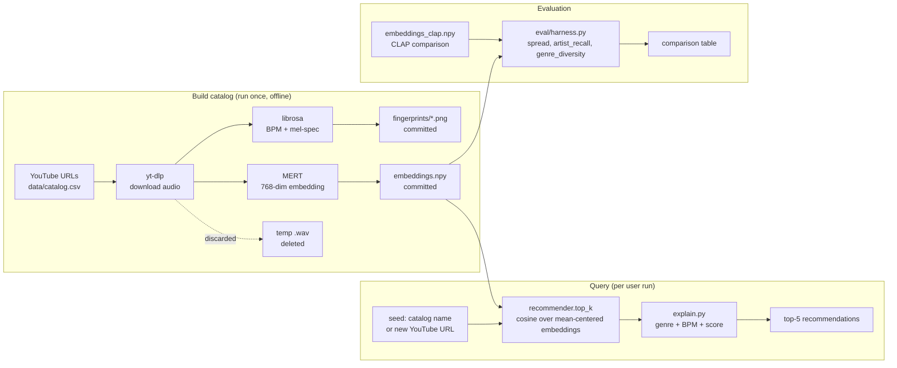

# 🎵 Antoine v2 — Audio-Similarity Music Recommender

**Final project for AI 110 Module 5.** Extends the [Module 3 music recommender starter](https://github.com/aardpark/ai110-module3show-musicrecommendersimulation-starter).

It takes a song that you provide from YouTube and finds other songs within the catalog that have a similar vibe independent of genre.

The previous failing of this recommender was a limitation of weighting. This gets around it by incorporating a pretrained audio model whose sole job is producing a vector for each song, so similarity becomes a math operation instead of a tuning problem. [MERT](https://huggingface.co/m-a-p/MERT-v1-95M) embeds every song into a 768-dim vector; cosine similarity retrieves nearest neighbors at query time — that retrieval is the RAG part.

| | Module 3 starter (Antoine v1) | This project (Antoine v2) |
|---|---|---|
| Catalog | 19 hand-tagged synthetic songs | 24 real songs from a personal YouTube playlist |
| Features | 6 hand-labeled floats per song | MERT 768-dim audio embedding + BPM + 224×224 mel-spec fingerprint |
| Similarity | weighted sum of attribute matches | cosine in mean-centered embedding space |
| AI feature | none | **RAG over a specialized music model (MERT)** |
| Inputs | `UserProfile(genre, mood, energy, …)` | `--seed <song name>` or `--youtube <url>` |
| Output | top-k + score breakdown | top-k + cross-genre flag + BPM proximity + cosine score |
| Ships in repo | `songs.csv` | `catalog.csv` + `embeddings.npy` + 24 fingerprint PNGs (no audio) |

The catalog can grow: adding a row to `catalog.csv` and re-running `build_catalog` extends the system without touching the model — every new song just adds another vector to the index.

The original heuristic recommender is preserved in `src/baseline.py` and used in the eval harness as the comparison baseline.

---

## System architecture



See [`assets/architecture.png`](assets/architecture.png) for an exported version.

the embeddings and fingerprints are committed, so cloning the repo gives you a working recommender in 125KB. no audio, no model download. MERT only loads when you give it a new youtube URL to embed.

---

## Setup

Tested on macOS (Apple Silicon) with Python 3.11+ and Python 3.14.

```bash
git clone https://github.com/aardpark/applied-ai-system-final.git
cd applied-ai-system-final
python3 -m venv .venv
source .venv/bin/activate
pip install -r requirements.txt
```

For the `--youtube` mode you also need `ffmpeg`:

```bash
brew install ffmpeg          # macOS
sudo apt install ffmpeg      # Debian/Ubuntu
```

---

## Usage

### List the catalog (no model load)

```bash
python -m src.main --list
```

### Recommend 5 songs like one already in the catalog (no model load, instant)

```bash
python -m src.main --seed "Daft Punk" -k 5
```

### Recommend from a new YouTube URL (downloads MERT ~400MB on first run)

```bash
python -m src.main --youtube "https://youtu.be/<id>" -k 5
```

### Run the eval harness

```bash
python -m eval.harness
```

### Run tests

```bash
pytest
```

### Rebuild the catalog from scratch (only if you change `CATALOG` in `src/build_catalog.py`)

```bash
python -m src.build_catalog
```

---

## Sample interactions

**Seed: Daft Punk — "One More Time"** (the canonical four-on-the-floor electronic track):

```
Top 5 recommendations like 'Daft Punk - One More Time':
  1. Aphex Twin — Alberto Balsalm  [electronic, 96 BPM]
     because: same genre (electronic) · different tempo (96 BPM vs your 123) · audio similarity +0.162
  2. Kanye West — ALL THE LOVE  [hip-hop, 118 BPM]
     because: crosses genre (hip-hop vs your electronic) · close BPM (118 vs your 123) · audio similarity +0.149
  3. MF DOOM — One Beer  [hip-hop, 118 BPM]
     because: crosses genre (hip-hop vs your electronic) · close BPM (118 vs your 123) · audio similarity +0.111
  4. RADWIMPS — Hyperventilation  [j-rock, 123 BPM]
     because: crosses genre (j-rock vs your electronic) · matches your seed at ~123 BPM · audio similarity +0.083
  5. Kanye West & Ty Dolla Sign — GOOD (DON'T DIE)  [hip-hop, 129 BPM]
     because: crosses genre (hip-hop vs your electronic) · close BPM (129 vs your 123) · audio similarity +0.077
```

**Seed: Labi Siffre — "Bless the Telephone"** (sparse 1972 acoustic ballad):

```
  1. Telefon Tel Aviv — Fahrenheit Fair Enough  [electronic, 129 BPM]
     because: crosses genre (electronic vs your soul/folk) · close BPM (129 vs your 136) · audio similarity +0.279
  2. Mitski — Your Best American Girl  [indie rock, 152 BPM]
     because: crosses genre (indie rock vs your soul/folk) · different tempo (152 BPM vs your 136) · audio similarity +0.259
```

**Seed: NewJeans — "ETA"** (k-pop):

```
  1. Kiichan — this is what falling in love feels like  [j-pop, 118 BPM]
  2. Yoeko Kurahashi — Sinking Town  [j-pop, 123 BPM]
```

a song's audio carries way more info than a genre tag does. songs that sound alike usually have more in common than songs that share a category, even when nothing else lines up on paper. that's basically the whole point and the cross-genre recs back it up.

---

## Design decisions and tradeoffs

### Why MERT (and why not CLAP)

We tried three embedding approaches end-to-end:

| Approach | Spread | Artist recall | What broke |
|---|---|---|---|
| CLAP (`laion/larger_clap_music`) | 0.40 | **0.00** | "Wheatus — Teenage Dirtbag" was scored as the #1 nearest neighbor for completely unrelated seeds (Daft Punk, Labi Siffre, Travis Scott). CLAP is contrastive-trained for audio↔text matching, not music↔music; the embeddings collapse to a narrow cone where everything is ≈0.96 similar to everything else. Mean-centering helped statistically but not qualitatively. |
| MFCC + chroma + spectral contrast | 0.25 | n/a | Honest baseline. Some good cross-genre matches (Mitski → Joji on bedroom-pop intimacy was the standout), but other matches were noisy. Useful as a sanity check that the pipeline itself works. |
| **MERT (`m-a-p/MERT-v1-95M`)** ← deployed | 0.13 | **0.20** | Smallest spread but the only model where (a) the Daft Punk ↔ Aphex Twin pair holds up symmetrically, (b) the j-pop / k-pop cluster forms correctly, (c) the artist-self-recall sanity check passes. Mean-centering on a per-catalog basis is essential. |

It was the wrong tool for the job. CLAP was trained to match audio clips to text captions, not to compare two music clips against each other — which is the task we actually had. The lesson: "pretrained model that mentions music" is not the same as "pretrained model that does what you want." MERT was trained explicitly for music representation learning. That's the difference.

### why 24 songs

small enough to clone and run in seconds, big enough to span 7 genres. the artist-recall metric needs at least one artist with multiple tracks (Kanye×4, Mitski×2 here), which sets a soft floor.

### why ship embeddings, not audio

audio files are copyright-grey for a public repo. embeddings are 73KB and reconstruct nothing audible. fingerprints are tiny PNGs that visualize the audio shape. anyone can rebuild from the youtube URLs in `catalog.csv`.

### why mean-centering matters

pretrained contrastive embeddings cluster in a "narrow cone" — every vector is similar to every other vector, so cosine becomes useless. subtracting the global mean and renormalizing pulls them apart. without it, MERT artist recall drops to zero.

### why "because…" mixes BPM and genre

the ranking only uses MERT cosine. BPM and genre show up in the explanation so you can see when the model picked something with a wildly different tempo or genre. it doesn't hide the mismatch.

---

## Testing summary

```
$ pytest
14 passed in 0.03s
```

- **`tests/test_recommender.py`** (12 tests): catalog loads cleanly, embeddings shape matches catalog, mean-centering preserves unit norm, query lookup handles substring/missing/ambiguous cases, top-k excludes seed and returns sorted scores, explanation strings include genre and BPM hints.
- **`tests/test_baseline.py`** (2 tests, inherited from Module 3 starter): the original heuristic Antoine still works.
- **`eval/harness.py`** (the +2 stretch): runs the spread / artist-recall / genre-diversity comparison across MERT and CLAP. This is what produced the design table above.

artist recall is the metric that caught CLAP. the cosine numbers alone didn't — CLAP's spread looked fine on paper. but ask "do mitski's two tracks find each other" and CLAP says no, MERT says yes 20% of the time. that's the difference.

---

## Limitations

the catalog has 24 songs because that's a curation choice, but if i were to actually grow this to thousands or tens of thousands of songs, two things would break. first, the embed step is slow. 24 songs took about a minute. 24000 would take most of a day. thats a real bottleneck if you want this to be something people add to. second, with that many songs the cross-genre matches start to mean less. theres always going to be some random pair that scores high just by coincidence, and the more songs you have the more of those false matches you find.

the other thing is that MERT is a black box. we don't actually know what its matching on. it could be picking up on rhythm, or production style, or some feature we cant even name. the recommendations look right to us but theres no way to verify that the model is matching on things we'd say matter and not on things we'd say dont. you kinda have to just trust the rankings, or run the eval harness and hope the metrics catch the failure modes.

(see [`model_card.md`](model_card.md) for the longer version with bias / misuse / collaboration notes.)

---

## Reflection

what surprised me was that pulling features off a youtube clip and doing math on them actually finds songs that share a vibe across genres. that was the whole bet of the project and i wasnt sure it would work.

v1 has less dependencies and you can easily adjust the formula to fit the recommendations as you want them to. v2 is more specialized but also more rigid. we have complex systems interacting to produce a similarity score now, and modifying the scoring system would not be trivial.

the real lesson is to be flexible. AI tools speed up development so you can come up with a plan, then try it. if it doesn't work, just keep iterating. as long as you have ideas about where to go, you can implement them trivially.

the spectrogram fingerprints in the repo are interesting but not actually used by the recommender right now. its all MERT cosine. in the future we could probably just compare fingerprints directly. same idea, simpler model.

the AI assistant i worked with was great at speeding up iteration but also confidently recommended CLAP as the right tool when it wasnt. the way to catch that wasnt to argue with the model, it was to run the eval harness.

---

## Repository structure

```
applied-ai-system-final/
├── README.md                 ← this file
├── model_card.md             ← bias/limits/misuse + AI-collab anecdotes
├── reflection.md             ← Module 3 reflection (preserved)
├── requirements.txt
├── assets/
│   └── architecture.png      ← exported diagram
├── data/
│   ├── catalog.csv           ← 24 tracks × (id, title, artist, genre, youtube_url, bpm, fingerprint_path)
│   ├── embeddings.npy        ← (24, 768) MERT vectors
│   ├── embeddings_clap.npy   ← (24, 512) CLAP vectors, kept for the harness comparison
│   ├── legacy_songs.csv      ← original Module 3 hand-tagged catalog (used by baseline tests)
│   └── fingerprints/         ← 24 × 224×224 mel-spectrogram PNGs
├── src/
│   ├── recommender.py        ← cosine over mean-centered embeddings
│   ├── embedder.py           ← MERT loader + audio download + fingerprint render
│   ├── explain.py            ← "because…" string generator
│   ├── main.py               ← CLI: --list / --seed / --youtube
│   ├── build_catalog.py      ← one-shot pipeline (download → embed → save)
│   └── baseline.py           ← the original heuristic Antoine, kept for the harness
├── eval/
│   └── harness.py            ← spread / artist_recall / genre_diversity table
└── tests/
    ├── test_recommender.py   ← 12 unit tests for the new pipeline
    └── test_baseline.py      ← 2 unit tests inherited from Module 3
```

---

## Demo walkthrough

🎥 **[Watch the demo](assets/demo.mp4)** — a recorded walkthrough showing the system running end-to-end.

[](https://github.com/aardpark/applied-ai-system-final/raw/main/assets/demo.mp4)

The video shows: catalog listing, three seed-song recommendations across different genres, one live YouTube-URL query (MERT inference + dedup filter), the eval harness output, and the unit tests passing.

To run the demo yourself:

```bash
./demo.sh           # interactive, press Enter between sections
./demo.sh --auto    # auto-advance with 10s pauses (hands-free)
```
