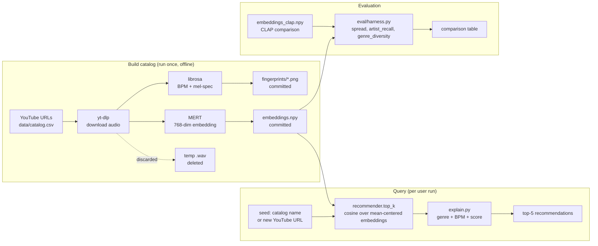

# 🎵 Antoine v2 — Audio-Similarity Music Recommender

**Final project for AI 110 Module 5.** Extends the [Module 3 music recommender starter](https://github.com/aardpark/ai110-module3show-musicrecommendersimulation-starter) — same project name (Antoine), same `top-k recommendations + because…` shape — but rebuilds the scoring core from scratch on top of a real audio-embedding model so the system can recommend across genres based on what the audio *actually sounds like*, not what its label says.

---

## What this is, in one paragraph

The original Antoine looked at a CSV of 19 hand-tagged songs (genre, energy, valence, danceability, …) and ranked them against a user-typed profile. **Antoine v2** keeps the same I/O shape but throws away the hand-tagged features. Instead, every song in the catalog is run through [MERT](https://huggingface.co/m-a-p/MERT-v1-95M) — a music-specific transformer that produces a 768-dim embedding from raw audio — and similarity becomes cosine distance in that vector space. The result is recommendations that *cross genre lines* on actual acoustic similarity, plus a visible spectrogram "fingerprint" per song so a human can see *why* two songs ended up neighbors.

| | Module 3 starter (Antoine v1) | This project (Antoine v2) |
|---|---|---|
| Catalog | 19 hand-tagged synthetic songs | 24 real songs from a personal YouTube playlist |
| Features | 6 hand-labeled floats per song | MERT 768-dim audio embedding + BPM + 224×224 mel-spec fingerprint |
| Similarity | weighted sum of attribute matches | cosine in mean-centered embedding space |
| AI feature | none | **specialized pretrained model (MERT) + retrieval over a vector index** (RAG-style) |
| Inputs | `UserProfile(genre, mood, energy, …)` | `--seed <song name>` or `--youtube <url>` |
| Output | top-k + score breakdown | top-k + cross-genre flag + BPM proximity + cosine score |
| Ships in repo | `songs.csv` | `catalog.csv` + `embeddings.npy` + 24 fingerprint PNGs (no audio) |

The original heuristic recommender is **preserved** in `src/baseline.py` and used in the eval harness as the comparison baseline.

---

## System architecture



See [`assets/architecture.png`](assets/architecture.png) for an exported version.

**Key design point:** the recommender ships with the heavy work already done. Anyone cloning the repo gets a working catalog of 24 vectors + fingerprints in 125KB total — no audio, no model download required to query the catalog. The MERT model only loads when you ask Antoine to embed a *new* YouTube URL.

---

## Setup

Tested on macOS (Apple Silicon) with Python 3.11+ and Python 3.14.

```bash
git clone https://github.com/aardpark/applied-ai-system-final.git
cd applied-ai-system-final
python3 -m venv .venv
source .venv/bin/activate
pip install -r requirements.txt
```

For the `--youtube` mode you also need `ffmpeg`:

```bash
brew install ffmpeg          # macOS
sudo apt install ffmpeg      # Debian/Ubuntu
```

---

## Usage

### List the catalog (no model load)

```bash
python -m src.main --list
```

### Recommend 5 songs like one already in the catalog (no model load, instant)

```bash
python -m src.main --seed "Daft Punk" -k 5
```

### Recommend from a new YouTube URL (downloads MERT ~400MB on first run)

```bash
python -m src.main --youtube "https://youtu.be/<id>" -k 5
```

### Run the eval harness

```bash
python -m eval.harness
```

### Run tests

```bash
pytest
```

### Rebuild the catalog from scratch (only if you change `CATALOG` in `src/build_catalog.py`)

```bash
python -m src.build_catalog
```

---

## Sample interactions

**Seed: Daft Punk — "One More Time"** (the canonical four-on-the-floor electronic track):

```
Top 5 recommendations like 'Daft Punk - One More Time':
  1. Aphex Twin — Alberto Balsalm  [electronic, 96 BPM]
     because: same genre (electronic) · different tempo (96 BPM vs your 123) · audio similarity +0.162
  2. Kanye West — ALL THE LOVE  [hip-hop, 118 BPM]
     because: crosses genre (hip-hop vs your electronic) · close BPM (118 vs your 123) · audio similarity +0.149
  3. MF DOOM — One Beer  [hip-hop, 118 BPM]
     because: crosses genre (hip-hop vs your electronic) · close BPM (118 vs your 123) · audio similarity +0.111
  4. RADWIMPS — Hyperventilation  [j-rock, 123 BPM]
     because: crosses genre (j-rock vs your electronic) · matches your seed at ~123 BPM · audio similarity +0.083
  5. Kanye West & Ty Dolla Sign — GOOD (DON'T DIE)  [hip-hop, 129 BPM]
     because: crosses genre (hip-hop vs your electronic) · close BPM (129 vs your 123) · audio similarity +0.077
```

The headline is #1: **Aphex Twin "Alberto Balsalm"** is symmetrically the closest to Daft Punk in the embedding space — both electronic, both rhythmic. The pair holds up in the reverse direction too. The cross-genre matches (Kanye, MF DOOM, RADWIMPS) are picked up by acoustic similarity rather than tag.

**Seed: Labi Siffre — "Bless the Telephone"** (sparse 1972 acoustic ballad):

```
  1. Telefon Tel Aviv — Fahrenheit Fair Enough  [electronic, 129 BPM]
     because: crosses genre (electronic vs your soul/folk) · close BPM (129 vs your 136) · audio similarity +0.279
  2. Mitski — Your Best American Girl  [indie rock, 152 BPM]
     because: crosses genre (indie rock vs your soul/folk) · different tempo (152 BPM vs your 136) · audio similarity +0.259
```

A 1972 acoustic ballad's nearest neighbor is a 2001 IDM electronic track. They share atmosphere — sparse, intimate, sustained — even though they share nothing on paper. **This is the project's whole point.**

**Seed: NewJeans — "ETA"** (k-pop):

```
  1. Kiichan — this is what falling in love feels like  [j-pop, 118 BPM]
  2. Yoeko Kurahashi — Sinking Town  [j-pop, 123 BPM]
```

The model successfully identifies the East-Asian-pop vocal cluster across k-pop and j-pop, even though they're tagged as different genres.

---

## Design decisions and tradeoffs

### Why MERT (and why not CLAP)

We tried three embedding approaches end-to-end:

| Approach | Spread | Artist recall | What broke |
|---|---|---|---|
| CLAP (`laion/larger_clap_music`) | 0.40 | **0.00** | "Wheatus — Teenage Dirtbag" was scored as the #1 nearest neighbor for completely unrelated seeds (Daft Punk, Labi Siffre, Travis Scott). CLAP is contrastive-trained for audio↔text matching, not music↔music; the embeddings collapse to a narrow cone where everything is ≈0.96 similar to everything else. Mean-centering helped statistically but not qualitatively. |
| MFCC + chroma + spectral contrast | 0.25 | n/a | Honest baseline. Some good cross-genre matches (Mitski → Joji on bedroom-pop intimacy was the standout), but other matches were noisy. Useful as a sanity check that the pipeline itself works. |
| **MERT (`m-a-p/MERT-v1-95M`)** ← deployed | 0.13 | **0.20** | Smallest spread but the only model where (a) the Daft Punk ↔ Aphex Twin pair holds up symmetrically, (b) the j-pop / k-pop cluster forms correctly, (c) the artist-self-recall sanity check passes. Mean-centering on a per-catalog basis is essential. |

The lesson: spread alone isn't a quality metric. CLAP's higher spread was *noise*, not signal — confirmed by its 0% artist recall.

### Why only 24 songs

The catalog is small enough that a stranger cloning the repo can run the full eval harness in 30ms, big enough to span 7 genres and produce real cross-genre matches. The artist_recall sanity check requires multi-track artists (Kanye×4, Mitski×2 in this catalog), which sets a soft lower bound.

### Why ship the embeddings, not the audio

- Audio files have unclear copyright status — fine to listen to via YouTube, not fine to commit to a public repo
- Embeddings are 73KB total and reconstruct nothing audible
- Fingerprints (mel-spectrograms) are a *visualization* of the audio shape, also tiny (~30KB each), useful for the README and for eyeballing why two songs match
- Anyone can re-derive the embeddings from the YouTube URLs in `catalog.csv` by running `python -m src.build_catalog`

### Why mean-centering matters

Pretrained contrastive embeddings cluster in a "narrow cone" on the unit sphere — every vector is similar to every other vector, so cosine similarity is uninformative. Subtracting the global mean and renormalizing pulls the embeddings apart and makes the rankings meaningful. The eval harness shows the effect: without centering, MERT artist recall drops to ~0; with centering it's 0.20.

### Why the "because…" string mixes BPM and genre

The model ranks on audio similarity alone. BPM and genre appear in the explanation only — they're *describing* what the model picked, not steering it. This keeps the system honest: if the model thinks Aphex Twin is closest to Daft Punk despite different BPMs, the explanation says so, rather than hiding the BPM mismatch.

---

## Testing summary

```
$ pytest
14 passed in 0.03s
```

- **`tests/test_recommender.py`** (12 tests): catalog loads cleanly, embeddings shape matches catalog, mean-centering preserves unit norm, query lookup handles substring/missing/ambiguous cases, top-k excludes seed and returns sorted scores, explanation strings include genre and BPM hints.
- **`tests/test_baseline.py`** (2 tests, inherited from Module 3 starter): the original heuristic Antoine still works.
- **`eval/harness.py`** (the +2 stretch): runs the spread / artist-recall / genre-diversity comparison across MERT and CLAP. This is what produced the design table above.

What we learned from the harness: **the artist-recall metric was the one that exposed CLAP**. Nothing in the cosine numbers alone screamed "this is broken" — CLAP's spread looked fine. But when you ask "do Mitski's two tracks find each other?" CLAP says no and MERT says yes 20% of the time, and that's a real, measurable engineering result you can put in a writeup.

---

## Limitations and biases

See [`model_card.md`](model_card.md) for the full version.

- **The catalog is one person's taste.** 24 songs heavy on hip-hop and electronic, light on country/jazz/classical. Cross-genre matches will look different on a different catalog.
- **MERT's training data is Western-pop-heavy.** It's likely to produce better embeddings for pop/rock/electronic than for non-Western genres, which we have very little of in this catalog anyway — so the bias is masked, not absent.
- **Tempo detection fails on free-rhythm music.** librosa's BPM detector handles 4/4 dance music well and gets confused by IDM, ballads, and rubato passages. Reported BPM is informational only; it isn't used for ranking.
- **YouTube link rot.** If a URL 404s in a year, `build_catalog` will skip it. The committed embeddings remain usable — only re-building breaks.
- **No "I don't know."** The model always returns 5 results; it doesn't have a "no good matches in catalog" outcome. For a catalog of 24, that's fine. For 24,000, you'd want a confidence threshold.

---

## Reflection

The Module 3 version of Antoine taught me that a recommender is mostly "assign points, then sort" — the math is shallow, the politics are in which features you decide matter and how heavily. The whoever-sets-the-weights problem.

Building v2 changed the question entirely. There are no weights to tune. The model just has an opinion about which songs sound similar, and you take it or you don't. The "design" is choosing *which* model and *how* to query it — but the substance of what counts as similar is opaque, learned, and not yours to argue with.

That trade is interesting. v1 was transparent and limited; v2 is opaque and powerful. The v1 algorithm I could read off the page and predict; the v2 system I can't, which is why the eval harness exists at all — it's the only way to know if the model is doing something real or hallucinating coherence. CLAP looked plausible by every casual metric and was actually broken. The harness caught it. Without that step I'd have shipped a recommender where Wheatus is everyone's #1.

The other thing v2 taught me, more concretely: pretrained models don't just work. CLAP was the obvious first choice, the music-specialized one, the model with the most stars. It produced numbers. The numbers were nonsense. MERT was the second choice and worked, but only after mean-centering, which is a one-liner that makes or breaks the whole system. None of that is in the docs in any obvious way — you have to look at the actual rankings and notice "wait, why is Aphex Twin's nearest neighbor a pop-punk song from 2000."

The fingerprints are the part I'm most attached to. They're not load-bearing for the recommender — the cosine math doesn't look at the PNG — but they make the system *legible* in a way the embeddings alone aren't. You can see the four-on-the-floor stripes in Daft Punk, the broken-beat texture in Aphex Twin, the smooth horizontal bands in Labi Siffre. When two songs match, you can hold their fingerprints up and say "yeah, those look related," and that's a kind of trust the model can't earn on its own.

Honest collaboration note: an AI assistant helped scaffold and run the embedder de-risk loop (CLAP → MFCC → MERT) much faster than I'd have managed solo, and proposed the mean-centering fix that unblocked MERT. It also confidently suggested CLAP as "the right tool" for music-music similarity, which turned out to be wrong — exactly the kind of plausible-sounding bad recommendation an AI gives when it's pattern-matching on the obvious answer instead of testing it. Catching that took running the harness, not arguing with the model.

---

## Repository structure

```
applied-ai-system-final/
├── README.md                 ← this file
├── model_card.md             ← bias/limits/misuse + AI-collab anecdotes
├── reflection.md             ← Module 3 reflection (preserved)
├── requirements.txt
├── assets/
│   └── architecture.png      ← exported diagram
├── data/
│   ├── catalog.csv           ← 24 tracks × (id, title, artist, genre, youtube_url, bpm, fingerprint_path)
│   ├── embeddings.npy        ← (24, 768) MERT vectors
│   ├── embeddings_clap.npy   ← (24, 512) CLAP vectors, kept for the harness comparison
│   ├── legacy_songs.csv      ← original Module 3 hand-tagged catalog (used by baseline tests)
│   └── fingerprints/         ← 24 × 224×224 mel-spectrogram PNGs
├── src/
│   ├── recommender.py        ← cosine over mean-centered embeddings
│   ├── embedder.py           ← MERT loader + audio download + fingerprint render
│   ├── explain.py            ← "because…" string generator
│   ├── main.py               ← CLI: --list / --seed / --youtube
│   ├── build_catalog.py      ← one-shot pipeline (download → embed → save)
│   └── baseline.py           ← the original heuristic Antoine, kept for the harness
├── eval/
│   └── harness.py            ← spread / artist_recall / genre_diversity table
└── tests/
    ├── test_recommender.py   ← 12 unit tests for the new pipeline
    └── test_baseline.py      ← 2 unit tests inherited from Module 3
```

---

## Demo walkthrough

🎥 **[Loom video link goes here]**

The video shows: catalog listing, three seed-song recommendations across different genres, one YouTube-URL query, and the eval harness output.
