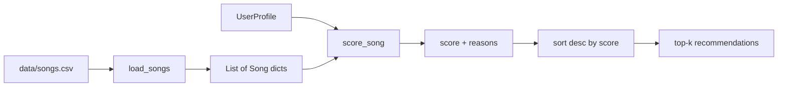
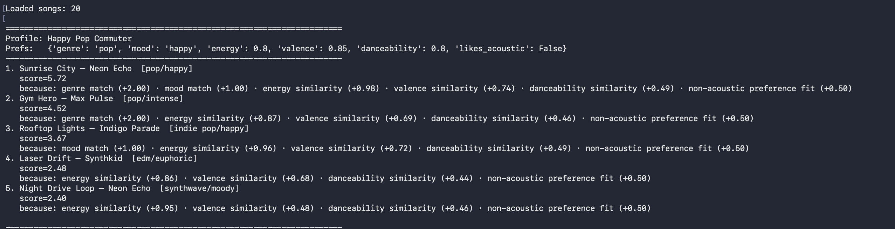
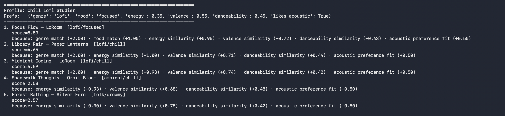
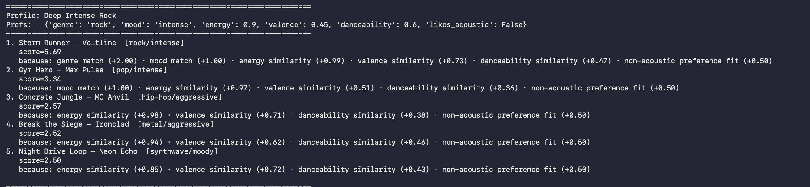
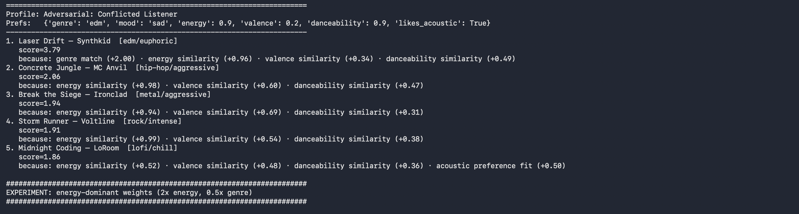
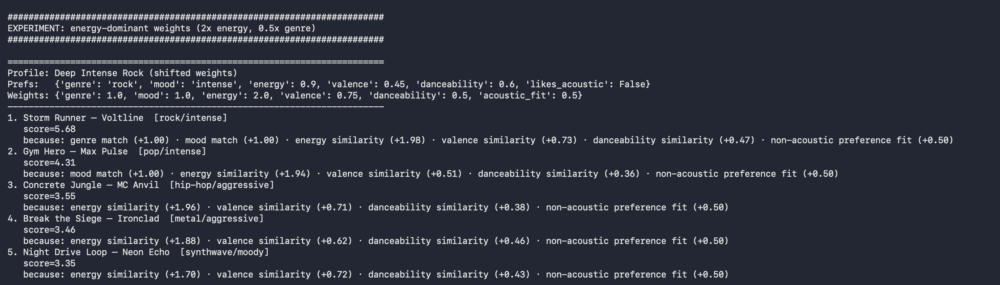

# 🎵 Music Recommender Simulation

## Project Summary

**Antoine** is a content-based music recommender. Given a small catalog of songs and a user's taste profile, it scores every song against the profile and returns the top *k* picks with a plain-English "because..." explanation for each.

Real platforms like Spotify and TikTok combine two ideas:

- **Collaborative filtering** — "people who liked what you like also liked X." Uses behavior across users (plays, skips, saves, watch-time). Doesn't need to know anything about the song itself.
- **Content-based filtering** — "this song looks like the stuff you already like." Uses song attributes (genre, tempo, energy, mood, acousticness) and compares them to the user's preferences.

Antoine is purely content-based. It is a classroom simulation, not a production system — no user history, no cross-user signal, no learning.

---

## How The System Works

### Data flow



Every song is judged individually by `score_song`, then the whole list is sorted to produce the ranking.

### Song features used

From `data/songs.csv`:

| Feature | Type | Role |
|---|---|---|
| `genre` | categorical | exact match |
| `mood` | categorical | exact match |
| `energy` | 0.0–1.0 | similarity |
| `valence` | 0.0–1.0 | similarity (musical positivity) |
| `danceability` | 0.0–1.0 | similarity |
| `acousticness` | 0.0–1.0 | threshold vs. user's `likes_acoustic` |
| `tempo_bpm` | numeric | unused in v1 (candidate for future work) |

### UserProfile fields

- `favorite_genre` (str)
- `favorite_mood` (str)
- `target_energy` (0.0–1.0)
- `target_valence` (0.0–1.0)
- `target_danceability` (0.0–1.0)
- `likes_acoustic` (bool)

### Algorithm Recipe

For each song, the score is the sum of:

| Component | Formula | Max |
|---|---|---|
| Genre match | `+2.0` if `song.genre == user.favorite_genre` | 2.0 |
| Mood match | `+1.0` if `song.mood == user.favorite_mood` | 1.0 |
| Energy similarity | `1.0 × (1 - \|target_energy - song.energy\|)` | 1.0 |
| Valence similarity | `0.75 × (1 - \|target_valence - song.valence\|)` | 0.75 |
| Danceability similarity | `0.5 × (1 - \|target_danceability - song.danceability\|)` | 0.5 |
| Acoustic fit | `+0.5` if `likes_acoustic == (song.acousticness >= 0.5)` | 0.5 |
| **Total max** | | **5.75** |

Each component that fires also contributes a short human-readable reason (e.g., `"genre match (+2.00)"`, `"energy similarity (+0.87)"`). The recommender returns the top *k* songs sorted by score, along with their reason lists.

### Expected biases (by design)

- **Genre dominates.** A genre match alone contributes +2.0 — more than the combined max of every continuous similarity. This is intentional for transparency (a mismatched genre almost never beats a matched one) but it means the system over-anchors on genre and under-values users who care more about mood or vibe than genre label.
- **Catalog skew propagates.** Over-represented genres in `songs.csv` (pop, lofi) will surface more often just because there are more of them to score.
- **Dead-feature risk.** `tempo_bpm` is stored but unused in v1; adding it without a user-side preference would be noise.

---

## Getting Started

### Setup

1. Create a virtual environment (optional but recommended):

   ```bash
   python -m venv .venv
   source .venv/bin/activate      # Mac or Linux
   .venv\Scripts\activate         # Windows

2. Install dependencies

```bash
pip install -r requirements.txt
```

3. Run the app:

```bash
python -m src.main
```

### Running Tests

Run the starter tests with:

```bash
pytest
```

You can add more tests in `tests/test_recommender.py`.

---

## Experiments You Tried

I ran four user profiles and one weight-shift experiment. Full pairwise write-up lives in [`reflection.md`](reflection.md).

**Profiles**

1. Happy Pop Commuter — pop / happy / 0.80 energy
2. Chill Lofi Studier — lofi / focused / 0.35 energy / likes acoustic
3. Deep Intense Rock — rock / intense / 0.90 energy
4. Conflicted Listener (adversarial) — edm / sad / 0.90 energy / 0.20 valence / likes acoustic

Each profile produced a sensible top-1 (genre+mood match where one exists). The adversarial profile — which asks for a mood that doesn't exist in the catalog — returned a lower top score (3.79 vs. 5.5+ for the clean profiles), which I take as the healthy behavior: the system refuses to fake confidence.

**Weight-shift experiment**

I doubled the energy weight (1.0 → 2.0) and halved the genre weight (2.0 → 1.0), then re-ran the rock profile. The top-1 did not change — genre is so structurally dominant that even with halved weight, a genre+mood match wins. What *did* change: the score gap between the rock match and non-rock high-energy tracks collapsed from 3.12 points to 2.13. The ranker became more promiscuous without losing its anchor.

### Screenshots

> *Run `python -m src.main` and drop the terminal screenshots into `docs/screenshots/` with these names, and they'll render below.*







---

## Limitations and Risks

Summary (full version in [`model_card.md`](model_card.md) §6):

- **Genre structurally dominates** — the genre match (+2.0) outweighs the max of every continuous feature combined, so a wrong-genre song almost never beats a right-genre song.
- **Filter bubble by construction** — a user listing "pop" is funneled toward pop, even if a hip-hop track would match their actual vibe better.
- **Catalog skew amplifies itself** — over-represented genres surface more often simply because there are more of them to score.
- **Mood is all-or-nothing** — no notion that "happy" and "euphoric" are close on a real mood axis.
- **Tiny catalog** — 20 songs, and all titles are fabricated.

---

## Reflection

Read and complete `model_card.md`:

[**Model Card**](model_card.md)

the main thing this project taught me is how much of a recommender is just "assign points, then sort." the math is shallow, the interesting part is which features you decide matter and by how much. whoever sets the weights is basically deciding the taste of everyone who uses the thing.

the bias stuff became pretty obvious once i ran the weight shift experiment. a user typing "pop" gets funneled to pop no matter how the rest of their profile looks because the genre weight is so high nothing else can really compete. thats the filter bubble problem in tiny form. scale it up to a platform where your history also feeds back into the weights and you can see how people get stuck in a vibe they maybe didnt choose.

